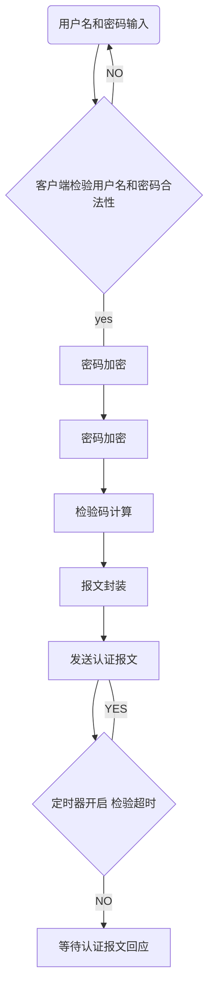
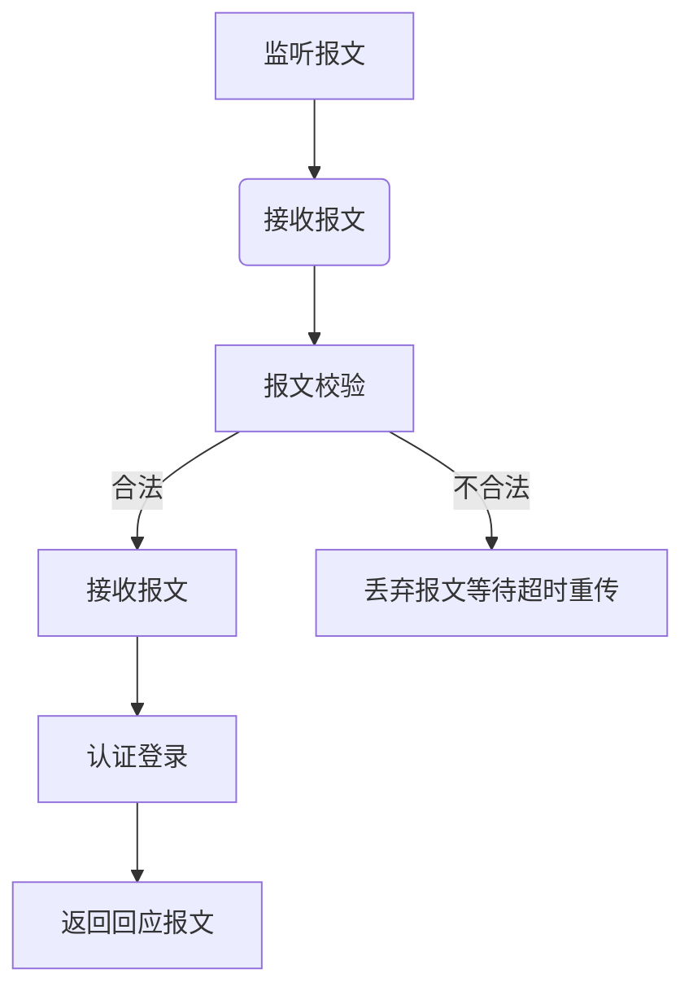

#迷你认证系统设计文档
[TOC]
##总体功能需求
1. 客户端发起认证请求到服务器，服务器认证用户身份，返回用户认证结果，如果成功返回用户的权限级别。
2. 客户端与服务器端采用UDP协议通信，服务器地址和端口在客户端事先指定。
3. 服务器上需要有一张用户表，表的内容包括用户名，密码，以及用户的级别
4. 需要设计考虑用户的密码信息传输安全
5. 请求类型即code值包括：
    - 		auth-request
    - 		auth-access
    - 		auth-reject
6. 服务器支持多客户端并发请求

##软件平台要求

- 	数据库管理系统：MySql
- 	操作系统：Linux
- 	开发工具：GCC
- 	版本管理工具：git
- 	第三方库：OpenSSL

##数据结构设设计
Common.h 头文件
```C
typedef char INT8; 
typedef short INT16; 
typedef int INT32; 
typedef unsigned char UCHAR; 
typedef signed char CHAR; 
typedef unsigned short UINT16; 
typedef unsigned int UINT32; 
typedef signed int INT32; 
typedef signed long long INT64; 
typedef unsigned long long UINT64; 
typedef int BOOL

```

###认证/回应报文结构
|  CODE(1byte)  |  ID(1byte)  |   LENGTHPKT(2byte )  |
|-----------|---------|-------------|
|*Auth*|
|type(1byte)|LENGTHCONTENT(1byte)|value(mutable)|

> CODE:1-requset,2-access,3-reject
> ID:请求/回应标识符
> LENGTH1：报文整体长度
> AUTH:校验码
>TYPE:1-UserName，2-PassWord，3-Level
>VALUE:ASCII编码
>LENGTH2：TLV的长度

***
###报文数据结构
```C
/*报文头部*/
struct pktHeader
{
INT8 code;
INT8 id;
INT16 lengthPkt;
INT8 md5Auth[16];
}

Struct content
{
INT8 type;
INT8 lengthItem;
INT16 value;
}

/*报文*/
struct pkt
{
Struct pktHeader head;
INT8 content[1500];
}

```

###用户数据库表项

| USERNAME|PassWord|Hash|UserPre|
|--------|--------|------|------|

***

##主要业务流程图


***-

  
***-

###业务数据流程江湖分析
####客户端业务流程



####服务器端业务流程


###代码结构
Client
*	clinent.c

Server
*	Server.c

Tools
*	md5Encrypt.c
*	deserialized.c
*	serialized.h

common.h

lnc
lib
Makefile
##客户端界面
- 使用GTK制作用户登录的界面


##容错性分析
1. 客户端行为分析
	（1）链路状况不佳导致请求报文丢失，每隔5秒重新发起认证。如果连续五次未收到回复报文则输出认证失败，停止认证。
	（2）密码或用户名错误，服务器返回reject，客户端提示重新输入用户名或密码。
	（3）密码长度不得超过16字节，超过时客户端直接提示重新输入密码。
	（4）用户名或密码含有非法字符，直接提示重新输入。

2. 服务器端行为分析
	（1）收到报文不合法则丢弃。
